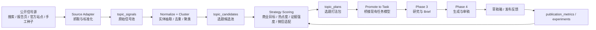

# 长期选题情报层蓝图

更新时间：2026-03-16
状态：Proposed

## 1. 文档目标

本文档用于给项目增加“长期获取选题”的能力基线。

当前系统已经能稳定完成：

`手动贴文章链接 -> 抓取原文 -> 分析 -> 搜索同题素材 -> 生成 brief -> 写稿 -> 审稿 -> 入公众号草稿箱`

但它仍然缺一层稳定、持续、可运营的“选题情报系统”。
也就是说，系统能把一个已经出现的题目加工成稿件，但还不能持续发现“下一篇该写什么”。

本轮的目标不是再写一批临时选题，而是把“选题发现 -> 评估 -> 规划 -> 推进到现有写稿链路”设计成一套长期能力，并明确增量落地路径。

## 2. 商业目的与产品定义

### 2.1 商业目的

结合前序调研，本项目的商业目的不应理解为“自动洗稿”，而应理解为：

- 持续发现对公众号业务有价值的信号
- 把信号加工成可执行的选题资产
- 把选题资产转成高质量公众号草稿
- 用发布后反馈反哺下一轮选题判断

最终要服务的不是“多产几篇文章”，而是下面这条更完整的业务链路：

`热点与参考信息 -> 选题判断 -> 内容生产 -> 微信草稿资产 -> 发布反馈 -> 下一轮选题优化`

### 2.2 产品定义

新增能力建议命名为：

`长期选题情报层（Topic Intelligence Layer）`

它不是替代现有 Phase 3 / Phase 4，而是放在它们前面，承担四件事：

- 稳定采集公开可用的内容信号
- 把分散信号归并成可消费的选题候选
- 结合业务目标给出优先级与建议打法
- 把高价值选题推进到现有 `task -> brief -> generation` 主链路

### 2.3 内容支柱

结合前序调研，建议把内容长期聚焦在 3 条支柱上：

- `微信生态机会类`
  - 例如微信搜一搜、公众号生态、内容分发、平台能力变化、内容创业机会
- `AI + 产业判断类`
  - 例如 AI 与制造业、智能体、产业数字化、政策与技术结合点
- `单人运营方法类`
  - 例如单人内容生产、增长方法、工作流、自动化、效率体系

这 3 条支柱既能承接热点，也能承接长期搜索流量和商业转化。

## 3. 当前系统缺口

当前系统的起点主要有两种：

- 手动提交一篇具体文章 URL
- 人工先给出一个题目，再让系统围绕它去写

这会带来 4 个问题：

- 选题来源不稳定，仍然依赖人工临场判断
- 热点捕捉和行业观察不能形成持续积累
- Phase 3 搜索出来的是“围绕已有原文补素材”，而不是“主动发现值得写的题目”
- 发布反馈已经开始沉淀，但尚未反向作用于选题层

因此，新能力的核心不是“再加一个搜索框”，而是补上一层持续运行的选题情报系统。

## 4. 需求摘要

### 4.1 功能需求

- 定时采集多个公开信号源，持续产出原始信号
- 对原始信号做清洗、标准化、去重和聚类
- 生成可排序的 `topic_candidate`
- 为每个候选选题补齐：
  - 业务目标
  - 文章类型
  - 内容支柱
  - 推荐切入角度
  - 关键词
  - CTA 模式
  - 推荐 seed URL 或 seed source pack
- 允许人工查看、筛选、收藏、忽略和一键推进为任务
- 逐步把发布反馈回写到选题评分模型里

### 4.2 非功能需求

- 优先复用现有 FastAPI + PostgreSQL + Redis + Worker 体系
- 第一阶段不新增高运维成本组件
- 所有中间结果可审计、可回溯、可重跑
- 不依赖受限登录态和高风险抓取
- 保留人工把关，不做全自动正式发布

### 4.3 明确不做

- 不把系统改成“无人工参与的热点发稿机”
- 不抓闭源或高风险受限平台私有内容
- 不在第一阶段引入复杂多 Agent 编排
- 不在第一阶段把现有 `task` 主模型推翻重做

## 5. 核心设计原则

- `先加前置能力层，不拆现有主链路`
- `先做候选选题中心，再做自动推进`
- `先用规则和可解释评分，再逐步引入反馈学习`
- `先复用当前单源 task 模型，再演进到多源 seed pack`
- `任何热点结论都必须带来源等级和证据链`

## 6. 总体架构



### 6.1 分层说明

- `Source Layer`
  - 负责持续采集公开信号，不直接负责文章生成
- `Signal Layer`
  - 负责原始信号标准化和可追溯落库
- `Candidate Layer`
  - 负责把多个信号合并成“一个值得写的主题”
- `Strategy Layer`
  - 负责把“值得写”进一步变成“怎么写更符合商业目标”
- `Execution Layer`
  - 负责把选题推入现有 Phase 3 / Phase 4
- `Feedback Layer`
  - 负责根据发布后的表现，修正下一轮选题排序和打法

## 7. 选题情报层与现有系统的关系

### 7.1 关键决策

新能力不应该独立复制一条新的写稿流水线，而应该作为现有流水线的前置层。

原因很简单：

- 当前系统已经有成熟的 `source_article / article_analysis / related_articles / content_brief / generation / review_report`
- 监控、后台、队列、反馈、审计都已经围绕现有 task 体系建立
- 如果重新做一套从选题到成稿的并行链路，维护成本会直接翻倍

### 7.2 第一阶段桥接方式

第一阶段推荐保留现有 `task` 以单个 `source_url` 为起点的约束，通过“桥接”接入：

- 每个 `topic_plan` 先选一个 `canonical_seed_url`
- 人工点击“推进为任务”后，仍然创建普通 `task`
- `task.source_url` 使用这个 `canonical_seed_url`
- 同时把选题层生成的策略信息绑定到 `task`

这样能最小改动复用现有 Phase 3 / Phase 4。

### 7.3 第二阶段演进方向

等第一阶段跑稳后，再把桥接从“单 seed URL”升级为“多 seed source pack”：

- 一个选题可以绑定多条高质量来源
- Phase 3 不再依赖唯一原文，而是基于 `topic_plan + source pack` 直接生成研究结果
- 这时现有 `source_article` 将从“唯一原文”演进为“主 seed source”

这个演进方向是重要的，但不应该在第一阶段直接做。

## 8. 领域模型建议

### 8.1 第一阶段最小表结构

| 实体 | 用途 | 第一阶段是否必须 |
|------|------|------------------|
| `topic_sources` | 定义信号源、抓取方式、状态、频率 | 是 |
| `topic_fetch_runs` | 记录每次抓取运行结果与失败原因 | 是 |
| `topic_signals` | 保存标准化后的原始信号 | 是 |
| `topic_candidates` | 聚类后的候选选题 | 是 |
| `topic_candidate_signals` | 候选选题与原始信号映射 | 是 |
| `topic_plans` | 选题打法包，供人工查看和推进 | 是 |
| `topic_plan_task_links` | 记录哪个 plan 被推进为哪个 task | 是 |

### 8.2 第二阶段增强表结构

| 实体 | 用途 | 进入时机 |
|------|------|----------|
| `topic_entities` | 主题实体、公司、产品、政策词等归一 | Phase 2 |
| `topic_keywords` | SEO / 搜索 / 传播关键词 | Phase 2 |
| `topic_watchlists` | 固定监控关键词、主题包、来源组 | Phase 1 |
| `topic_feedback_snapshots` | 选题级表现回写快照 | Phase 3 |
| `topic_strategy_profiles` | 业务目标、CTA、文章类型模板 | Phase 2 |

### 8.3 `topic_signals` 建议字段

- `source_id`
- `signal_type`
  - `search_result`
  - `report_update`
  - `official_news`
  - `manual_seed`
- `title`
- `url`
- `normalized_url`
- `summary`
- `source_site`
- `published_at`
- `discovered_at`
- `raw_payload`
- `content_hash`
- `source_tier`
- `fetch_status`

### 8.4 `topic_candidates` 建议字段

- `cluster_key`
- `topic_title`
- `topic_summary`
- `content_pillar`
- `hotness_score`
- `commercial_fit_score`
- `evidence_score`
- `novelty_score`
- `wechat_fit_score`
- `risk_score`
- `total_score`
- `recommended_business_goal`
- `recommended_article_type`
- `canonical_seed_url`
- `status`
  - `new`
  - `watching`
  - `planned`
  - `promoted`
  - `ignored`

### 8.5 `topic_plans` 建议字段

- `candidate_id`
- `business_goal`
  - `grow_followers`
  - `build_trust`
  - `generate_leads`
  - `drive_store`
  - `build_brand`
- `article_type`
  - `hot_commentary`
  - `industry_analysis`
  - `methodology`
  - `case_review`
  - `decision_guide`
- `angle`
- `why_now`
- `target_reader`
- `must_cover`
- `must_avoid`
- `keywords`
- `search_friendly_title`
- `distribution_friendly_title`
- `summary`
- `cta_mode`
- `source_grade`
- `recommended_queries`
- `seed_source_pack`

## 9. 信号源策略

### 9.1 第一阶段建议只接 3 类来源

- `搜索监控型来源`
  - 复用现有 `SearchService`
  - 通过固定 watchlist query 定时搜索
- `固定页面监控型来源`
  - 例如官方报告页、公开行业报告页、权威新闻页
  - 适合监控更新频率较低但价值高的来源
- `人工种子来源`
  - 允许后台手工输入关键词、URL、机构或关注主题

### 9.2 为什么第一阶段不直接上更多来源

- 当前最缺的是“持续发现与排序能力”，不是“信号数量”
- 现有系统已经证明搜索与抓取链路可用，优先复用成本最低
- 来源越多，去重、聚类、合规和监控成本越高

### 9.3 第一阶段 watchlist 推荐

建议先围绕 3 条内容支柱建立 watchlist：

- `微信生态机会`
  - 微信公众号
  - 微信搜一搜
  - 微信内容生态
  - 公众号流量
  - 企业微信内容
- `AI + 产业判断`
  - AI 制造业
  - 智能体
  - AI 政策
  - 产业数字化
  - AI 商业化
- `单人运营方法`
  - 内容创业
  - 自动化运营
  - 单人公司
  - 公众号增长
  - 知识工作流

## 10. 评分策略

### 10.1 第一阶段评分公式

建议先用可解释规则分，不急于做学习排序：

```text
总分 = 商业匹配 25%
     + 热点时效 20%
     + 证据强度 15%
     + 差异空间 15%
     + 微信适配 15%
     + 转化潜力 10%
     - 风险扣分
```

### 10.2 各评分维度建议

- `商业匹配`
  - 是否服务当前账号想获得的结果：涨粉、信任、咨询、带货、品牌
- `热点时效`
  - 是否处于公开讨论上升期，是否值得马上写
- `证据强度`
  - 是否有权威来源、报告、数据、案例支撑
- `差异空间`
  - 是否能避免重复平台已有通稿，能否讲出新判断
- `微信适配`
  - 是否适合公众号读者的阅读场景与传播方式
- `转化潜力`
  - 是否容易自然导向关注、私域、咨询或产品承接
- `风险扣分`
  - 政策、金融、医疗、社会事件等高风险题材自动降权

### 10.3 来源分级

建议在 `topic_signal` 和 `topic_plan` 上引入来源分级：

- `S`
  - 官方公告、财报、政府文件、权威机构报告
- `A`
  - 主流行业媒体、头部研究机构、平台官方公开解释
- `B`
  - 一般媒体、第三方观察稿
- `C`
  - 观点帖、二手转载、低可验证内容

## 11. 服务与队列设计

### 11.1 第一阶段服务切分

- `TopicSourceRegistry`
  - 管理已启用的 sources 和 watchlists
- `TopicFetchService`
  - 负责按 source 类型抓取信号
- `TopicNormalizeService`
  - 负责 URL 规范化、来源分级、摘要清洗
- `TopicClusterService`
  - 负责按标题、关键词、实体做粗聚类
- `TopicScoringService`
  - 负责计算候选分和推荐策略
- `TopicPlanService`
  - 负责输出 `topic_plan`
- `TopicPromotionService`
  - 负责把 plan 推进为现有 task

### 11.2 第一阶段 worker 切分

为了避免过早拆得太细，建议只上两类 worker：

- `topic_fetch_worker`
  - 负责抓取、标准化、落库 `topic_signals`
- `topic_plan_worker`
  - 负责聚类、打分、生成 `topic_candidates / topic_plans`

等数据量和吞吐明显上涨，再考虑拆出独立 `cluster` 或 `score` worker。

### 11.3 调度方式

第一阶段优先保持和现有项目一致：

- Redis 队列
- 独立 worker 脚本
- 通过 cron 或内部调度入口触发 enqueue

不建议第一阶段为了“自动化”再额外引入重量级调度平台。

## 12. 接口与后台方向

### 12.1 第一阶段 API

- `POST /internal/v1/topic-sources/{source_id}/run`
- `POST /internal/v1/topic-sources/{source_id}/enqueue`
- `GET /api/v1/admin/topics/snapshot`
- `GET /api/v1/admin/topics/candidates`
- `GET /api/v1/admin/topics/plans/{plan_id}`
- `POST /api/v1/admin/topics/plans/{plan_id}/promote`
- `POST /api/v1/admin/topics/candidates/{candidate_id}/ignore`
- `POST /api/v1/admin/topics/candidates/{candidate_id}/watch`

### 12.2 第一阶段后台页

建议新增：

- `/admin/topics`

页面分 3 区：

- `信号概览`
  - 最近抓取、失败来源、近 24 小时新增候选
- `候选选题池`
  - 按支柱、状态、分数、来源、时效筛选
- `选题打法详情`
  - 展示 angle、why now、关键词、推荐标题、CTA、seed sources

### 12.3 与现有 `/admin` 的关系

- `/admin` 仍然是任务工作台
- `/admin/topics` 是选题前台
- 被推进的选题进入普通任务流后，再回到 `/admin` / `/admin/phase5`

## 13. 对现有 Phase 3 / Phase 4 的改动建议

### 13.1 第一阶段最小改动

- `Task` 仍然从 `source_url` 启动
- 新增 `topic_plan_task_links`
- Phase 3 增加“如果 task 关联了 topic plan，则把 plan 的 angle / must_cover / keywords 作为额外上下文”

### 13.2 第二阶段增强

- Phase 3 查询构造从固定三组 query，升级为：
  - `topic plan queries`
  - `candidate keywords`
  - `business-goal aware queries`
- `content_brief` 新增或复用字段承接：
  - `business_goal`
  - `article_type`
  - `cta_mode`
  - `keywords`
  - `why_now`

### 13.3 第三阶段闭环

- `publication_metrics` 按 topic plan / candidate 回写
- Prompt 实验榜不只比较模型输出，也比较“哪类选题打法更有效”

## 14. 演进路线图

### Phase 0：文档冻结与方案确认

交付物：

- 蓝图文档
- ADR
- 文档索引更新
- 实施拆解

验收：

- 明确第一阶段不推翻现有 task 模型
- 明确第一阶段表结构、worker、后台和 API 范围

### Phase 1：最小可运行的选题候选池

交付物：

- `topic_sources / topic_fetch_runs / topic_signals / topic_candidates / topic_plans`
- `topic_fetch_worker / topic_plan_worker`
- 2 到 3 类 source adapter
- 基础后台候选池 API

验收：

- 系统能定时抓到信号
- 能看到候选选题
- 候选选题有可解释的评分

### Phase 2：选题打法与人工推进

交付物：

- `/admin/topics`
- `promote to task`
- `topic plan -> task` 关联
- Phase 3 对 plan 上下文的消费

验收：

- 人工可以从选题池一键推进到现有主链路
- 新任务的 brief 明显体现 topic plan 的 angle 和目标

### Phase 3：反馈闭环与半自动优先级

交付物：

- 选题级反馈指标
- 候选排序权重可配置
- 基于历史表现的加权推荐

验收：

- 至少能回答“什么选题更适合这个号”
- 排序不再只看热点和新鲜度

### Phase 4：多源 seed pack 与自动推进

交付物：

- 一个选题可绑定多个 seed source
- 自动推进阈值
- 候选池监控与告警

验收：

- 高质量题目可以半自动进入生产队列
- 选题系统成为持续运转的前置层，而不是人工偶尔点一次的页面

## 15. 第一阶段实施切片建议

建议按下面顺序逐步实现，不要一次把“抓取、聚类、评分、后台、自动推进”全上完。

### Slice 1：数据模型与 source registry

- 新增最小表结构和 repository
- 定义 `TopicSourceType` / `TopicCandidateStatus`
- 实现 `topic_sources` 的静态注册和系统设置读取

### Slice 2：Search watchlist adapter

- 复用现有 `SearchService`
- 支持 watchlist query 定时抓取
- 把搜索结果落成 `topic_signals`

### Slice 3：候选聚类与基础评分

- 按 `normalized_url + 标题关键词 + 主题词` 粗聚类
- 产出 `topic_candidates`
- 产出第一版 `topic_plans`

### Slice 4：后台候选池只读页

- 支持查看候选、筛选、看详情
- 暂时不做复杂编辑器

### Slice 5：promote to task

- 从 `topic_plan` 创建普通 `task`
- 绑定 `topic_plan_task_links`
- 让 Phase 3 读取选题上下文

这是第一条真正可用的闭环。

## 16. 风险与缓解

| 风险 | 说明 | 缓解 |
|------|------|------|
| 候选太多但质量低 | 抓到很多信号，不等于值得写 | 第一阶段严格控制来源和 watchlist，不先追求量 |
| 过早改动 task 模型 | 可能影响现有线上主链路 | 第一阶段只做桥接，不推翻当前 task 起点 |
| 评分不稳定 | 单纯热点分会导致标题党 | 加入商业匹配、证据强度、风险扣分 |
| 来源合规问题 | 某些平台不适合抓取 | 第一阶段只接公开、可访问、低风险来源 |
| UI 过早做复杂 | 候选池还没跑稳就做重交互 | 第一阶段后台页只做筛选、查看、推进 |

## 17. 建议的下一步

文档落地后，建议直接进入 `Phase 1 / Slice 1`：

- 先定表结构
- 再接第一类 source adapter
- 再把候选池最小闭环跑起来

如果这一层没有先跑通，就不应该继续做自动推进和复杂后台页。

## 18. 参考输入

本蓝图结合了前序调研结论，主要包括：

- 微信生态、公众号内容生态与搜一搜能力变化
- AI 与产业、政策和制造业结合的公开热点
- 单人运营与内容生产方法的持续需求
- 腾讯财报、QuestMobile 生态报告、政府工作报告热词、公开平台生态复盘等公开资料

这些资料本轮用于确定内容支柱、评分维度和来源优先级，而不是直接写成某一篇文章。
