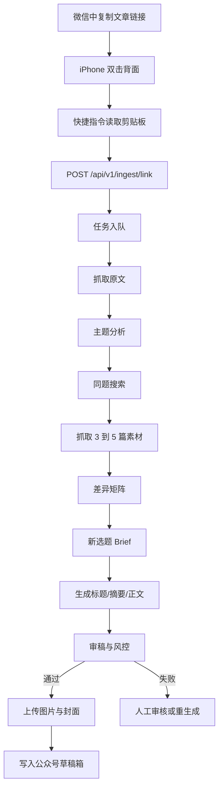

# 微信公众号选题重构与草稿生产系统实施方案

## 1. 项目定位

本项目的产品定义不是“自动洗稿器”，而是一个`选题重构 + 素材综合 + 安全审稿 + 入草稿箱`的半自动内容工厂。

目标链路如下：

`复制微信文章链接 -> iPhone 双击背面触发快捷指令 -> 服务器接收链接 -> 抓取原文 -> 分析主题 -> 搜索同题素材 -> 生成新稿 -> 风控审稿 -> 存入公众号草稿箱 -> 人工浏览后手动发布`

这样定义有三个直接收益：

- 降低版权、平台合规和 AI 标识风险。
- 让内容生成从“句子改写”升级为“同题重构”。
- 把系统做成可持续优化的内容生产流水线，而不是一次性脚本。

### 1.1 文档留存原则

- 所有已确认的项目信息必须同步写入 `docs/`，不能只保留在聊天上下文中。
- 需求、依赖、风险、环境变量、技术决策、阶段结论都属于必须留存的信息。
- 阶段开始前补齐输入文档，阶段结束后补齐结论和变更。
- 当前文档索引见 `docs/README.md`。
- 原始密钥和令牌不写入 Markdown 明文，文档只记录接收状态、用途和环境变量映射。

## 2. 目标与边界

### 2.1 核心目标

- 让手机端采集动作足够轻：复制链接后双击背面即可完成提交。
- 保证生成稿明显不是原文换词，具备信息增量和新角度。
- 所有内容生产过程可回溯、可重跑、可人工介入。
- 自动把通过审核的稿件推送到公众号草稿箱，供人工终审和发布。

### 2.2 首版明确不做

- 不做自动正式发布。
- 不做逐句、逐段洗稿。
- 不做复杂的自动封面设计系统。
- 不做绕过限制的抓取。

### 2.3 成功标准

- 采集成功率 >= 95%
- 原文抓取成功率 >= 85%
- 草稿箱推送成功率 >= 95%
- 自动审稿后可直接进入草稿箱的比例 >= 60%
- 所有任务都有完整审计轨迹

## 3. 外部约束与合规基线

### 3.1 iPhone 入口约束

- 主入口采用`复制链接 + 快捷指令读取剪贴板 + 双击背面触发`。
- 备用入口采用`微信分享菜单 -> 发送到快捷指令`。
- 不依赖“读取微信当前页面屏幕内容”作为主方案，因为 Apple 官方公开示例主要覆盖 Safari、Maps、Photos 等场景，微信文章场景下稳定性不如剪贴板方案。

### 3.2 微信公众号接口约束

- 服务端通过`AppID/AppSecret -> access_token`调用公众号接口。
- `access_token`必须集中缓存和刷新，避免多服务互相覆盖。
- 服务器出口 IP 需要加入微信白名单。
- 首版目标接口是`草稿箱新增`，不接正式发布流程。
- 文章正文走 HTML。
- 封面必须使用微信侧可用的`thumb_media_id`。
- 文内图片应先上传到微信侧获取可用 URL，不依赖外链图片。
- 具体字段和权限需要在正式开发前再次核对官方文档与公众号后台权限页。

### 3.3 合规与平台风险

- 《人工智能生成合成内容标识办法》已于`2025 年 9 月 1 日`施行。
- 系统默认只自动入草稿箱，不自动正式发布。
- 每篇稿件都必须经过`原创度检查、事实校验、风险审查、人工终审`。
- 对高风险类别内容强制转人工：新闻、政策、医疗、金融、重大社会事件。
- 在系统内留存 AI 参与生成和审稿的审计轨迹，供人工发布时声明和复核。

## 4. 总体方案

### 4.1 端到端流程



### 4.2 核心设计原则

- 流水线尽量确定化，只有创造性节点使用 LLM。
- 所有中间结果落库，不能只有最终文章。
- 首版优先打通链路，再优化“爆款能力”。
- 生成策略以`同题重构`为核心，而不是`同义改写`。

## 5. 系统架构

### 5.1 逻辑分层

- `入口层`：iPhone 快捷指令、接入 API、鉴权、幂等去重。
- `任务层`：队列调度、状态机、重试控制。
- `采集层`：原文抓取、内容清洗、快照存储。
- `研究层`：主题分析、搜索 query 生成、同题素材筛选、差异矩阵。
- `创作层`：新选题 Brief、大纲、标题、正文、摘要、封面文案。
- `审稿层`：相似度、事实、风险、可读性、风格适配、AI 标识提示。
- `发布层`：微信公众号素材上传、草稿箱写入、回写 media_id。
- `后台层`：任务看板、对比审稿页、重跑控制台、Prompt 版本管理。

### 5.2 推荐技术栈

- 后端：`FastAPI`
- 队列：`Redis + Celery` 或 `Redis + ARQ`
- 数据库：`PostgreSQL`
- 向量检索：`pgvector`
- 抓取：`httpx + Playwright`
- 正文清洗：`trafilatura / readability-lxml / BeautifulSoup`
- 对象存储：`S3 兼容对象存储`
- 后台：`Next.js` 或轻量管理台
- LLM 编排：自研 pipeline，首版不必上复杂多 Agent

## 6. 模块设计

### 6.1 iPhone 入口层

快捷指令只负责稳定地把链接发到服务器。

建议动作：

1. 读取剪贴板。
2. 校验是否为 URL。
3. 生成时间戳、随机串、签名。
4. `POST` 到`/api/v1/ingest/link`。
5. 显示“已加入任务队列”通知。

鉴权建议：

- `Authorization: Bearer <token>`，适合 MVP。
- 或增加 `X-Timestamp / X-Nonce / X-Signature(HMAC-SHA256)`，提升安全性和防重放能力。

### 6.2 接入层 API

职责：

- URL 标准化
- 幂等去重
- 建立任务
- 立即返回任务 ID

不在这个层面做耗时操作，避免手机端等待超时。

### 6.3 采集层

职责：

- 抓原文 HTML
- 提取标题、作者、发布时间、摘要、正文、配图
- 保存快照
- 清洗正文噪音

抓取策略：

- 一级：普通 HTTP 抓取
- 二级：Headless 浏览器兜底
- 两级都失败：标记为`needs_manual_source`

明确约束：

- 不做绕过限制的反爬方案
- 不做账号登录态共享抓取

### 6.4 研究层

职责：

- 从原文抽取主题、受众、情绪、论点、事实点
- 自动生成三组搜索 query
- 搜索并抓取 3 到 5 篇同题可访问内容
- 形成差异矩阵

三组 query：

- 标准主题：找到直接同题文章
- 热点主题：补足时效性和讨论热度
- 反向主题：补足差异化视角

### 6.5 创作层

职责：

- 先产出新选题 Brief
- 再产出大纲
- 再产出标题组
- 再生成正文和摘要
- 最后输出封面短文案建议

核心要求：

- 不沿用原文段落顺序
- 不沿用原文论证顺序
- 不保留原文标志性句式
- 必须补充新信息或新解释

### 6.6 审稿层

职责：

- 相似度检查
- 事实核验
- 风险检查
- 风格检查
- 微信格式检查
- AI 标识提示

输出明确决策：

- `pass`
- `revise`
- `reject`

### 6.7 发布层

职责：

- 上传正文内图片
- 上传封面素材
- Markdown 转 HTML
- 调公众号草稿接口
- 回写`media_id`

首版仅支持：

- 保存草稿箱
- 不触发自动正式发布

## 7. API 设计

### 7.1 对外 API

#### 7.1.1 接收链接

```http
POST /api/v1/ingest/link
Authorization: Bearer <token>
Content-Type: application/json

{
  "url": "https://mp.weixin.qq.com/s/xxxx",
  "source": "ios-shortcuts",
  "device_id": "iphone-01",
  "trigger": "backtap",
  "note": ""
}
```

返回：

```json
{
  "task_id": "tsk_01J...",
  "status": "queued",
  "deduped": false
}
```

#### 7.1.2 查询任务状态

```http
GET /api/v1/tasks/{task_id}
```

返回：

```json
{
  "task_id": "tsk_01J...",
  "status": "draft_saved",
  "progress": 100,
  "wechat_media_id": "xxx",
  "title": "新生成标题",
  "error": null
}
```

#### 7.1.3 重跑任务

```http
POST /api/v1/tasks/{task_id}/retry
Content-Type: application/json

{
  "mode": "new_angle",
  "reason": "title weak"
}
```

#### 7.1.4 保留素材重新生成

```http
POST /api/v1/tasks/{task_id}/regenerate
Content-Type: application/json

{
  "angle": "争议切入",
  "tone": "理性克制",
  "length": 1600
}
```

### 7.2 内部 API

#### 7.2.1 拉取同题素材

```http
POST /internal/v1/research/search-related
Content-Type: application/json

{
  "task_id": "tsk_xxx"
}
```

#### 7.2.2 审稿

```http
POST /internal/v1/review/run
Content-Type: application/json

{
  "task_id": "tsk_xxx",
  "generation_id": "gen_xxx"
}
```

#### 7.2.3 推送微信公众号草稿

```http
POST /internal/v1/tasks/{task_id}/push-wechat-draft
```

## 8. 数据库设计

建议采用 PostgreSQL，并保留版本化和审计能力。

### 8.1 tasks

```sql
tasks (
  id uuid pk,
  task_code varchar(32) unique,
  source_url text not null,
  normalized_url text not null,
  source_type varchar(32),
  status varchar(32) not null,
  priority int default 100,
  created_at timestamptz,
  updated_at timestamptz,
  error_code varchar(64),
  error_message text,
  retry_count int default 0
)
```

### 8.2 source_articles

```sql
source_articles (
  id uuid pk,
  task_id uuid references tasks(id),
  url text,
  title text,
  author text,
  published_at timestamptz,
  raw_html text,
  cleaned_text text,
  summary text,
  snapshot_path text,
  fetch_status varchar(32),
  word_count int,
  content_hash varchar(64),
  created_at timestamptz
)
```

### 8.3 related_articles

```sql
related_articles (
  id uuid pk,
  task_id uuid references tasks(id),
  query_text text,
  rank_no int,
  url text,
  title text,
  source_site text,
  published_at timestamptz,
  popularity_score numeric,
  relevance_score numeric,
  diversity_score numeric,
  factual_density_score numeric,
  raw_html text,
  cleaned_text text,
  fetch_status varchar(32),
  selected boolean default false,
  created_at timestamptz
)
```

### 8.4 article_analysis

```sql
article_analysis (
  id uuid pk,
  task_id uuid references tasks(id),
  theme text,
  audience text,
  angle text,
  tone text,
  key_points jsonb,
  facts jsonb,
  hooks jsonb,
  risks jsonb,
  gaps jsonb,
  structure jsonb,
  created_at timestamptz
)
```

### 8.5 content_briefs

```sql
content_briefs (
  id uuid pk,
  task_id uuid references tasks(id),
  brief_version int,
  positioning text,
  new_angle text,
  target_reader text,
  must_cover jsonb,
  must_avoid jsonb,
  outline jsonb,
  title_directions jsonb,
  created_at timestamptz
)
```

### 8.6 generations

```sql
generations (
  id uuid pk,
  task_id uuid references tasks(id),
  brief_id uuid references content_briefs(id),
  version_no int,
  model_name varchar(64),
  title text,
  subtitle text,
  digest text,
  markdown_content text,
  html_content text,
  score_overall numeric,
  score_title numeric,
  score_readability numeric,
  score_novelty numeric,
  score_risk numeric,
  status varchar(32),
  created_at timestamptz
)
```

### 8.7 review_reports

```sql
review_reports (
  id uuid pk,
  generation_id uuid references generations(id),
  similarity_score numeric,
  factual_risk_score numeric,
  policy_risk_score numeric,
  readability_score numeric,
  title_score numeric,
  novelty_score numeric,
  issues jsonb,
  suggestions jsonb,
  final_decision varchar(32),
  created_at timestamptz
)
```

### 8.8 wechat_drafts

```sql
wechat_drafts (
  id uuid pk,
  task_id uuid references tasks(id),
  generation_id uuid references generations(id),
  media_id varchar(128),
  push_status varchar(32),
  push_response jsonb,
  created_at timestamptz
)
```

### 8.9 prompt_versions

```sql
prompt_versions (
  id uuid pk,
  prompt_type varchar(32),
  version_name varchar(64),
  system_prompt text,
  user_template text,
  is_active boolean default false,
  created_at timestamptz
)
```

### 8.10 audit_logs

```sql
audit_logs (
  id uuid pk,
  task_id uuid,
  action varchar(64),
  operator varchar(64),
  payload jsonb,
  created_at timestamptz
)
```

### 8.11 style_assets

```sql
style_assets (
  id uuid pk,
  source_type varchar(32),         -- self / benchmark
  title text,
  content text,
  tags jsonb,
  performance_metrics jsonb,
  embedding vector,
  created_at timestamptz
)
```

### 8.12 publication_metrics

```sql
publication_metrics (
  id uuid pk,
  task_id uuid references tasks(id),
  generation_id uuid references generations(id),
  wechat_media_id varchar(128),
  stat_date date,
  read_count int,
  read_user_count int,
  share_count int,
  share_user_count int,
  favorite_count int,
  completed_read_rate numeric,
  source jsonb,
  created_at timestamptz
)
```

### 8.13 prompt_experiments

```sql
prompt_experiments (
  id uuid pk,
  generation_id uuid references generations(id),
  prompt_version_id uuid references prompt_versions(id),
  dimension varchar(32),          -- title / opening / structure / review
  variant_key varchar(64),
  predicted_score numeric,
  actual_score numeric,
  outcome_label varchar(32),      -- strong / normal / weak
  created_at timestamptz
)
```

## 9. 任务状态机

### 9.1 主流程状态

```text
queued
-> deduping
-> fetching_source
-> source_ready
-> analyzing_source
-> searching_related
-> fetching_related
-> building_brief
-> generating
-> reviewing
-> review_passed
-> pushing_wechat_draft
-> draft_saved
```

### 9.2 失败状态

```text
fetch_failed
search_failed
generate_failed
review_failed
push_failed
```

### 9.3 人工介入状态

```text
needs_manual_source
needs_manual_review
needs_regenerate
```

### 9.4 重试规则

- 抓取失败：最多重试 2 次
- 搜索失败：换 query 重试 2 次
- 生成失败：同 brief 重试 1 次，再换 angle 重跑
- 审稿失败：自动修订 1 次，仍失败则转人工
- 推草稿失败：刷新 token 后重试 1 次，再转人工

## 10. 内容研究与生成策略

### 10.1 正确做法：不是改句子，而是重做选题

内容流水线应固定为以下四步：

1. 信息拆解：把原文和同题文章拆成事实、观点、案例、结论、情绪点、传播钩子。
2. 差异矩阵：识别重复信息、证据不足点、无人覆盖的角度、适合目标读者的补充点。
3. 新选题 Brief：先确定目标读者、阅读收益、推荐角度、必须覆盖点和必须回避点。
4. 按新结构写作：严格避免继承原文段落顺序、论证顺序和标志性句式。

### 10.2 同题搜索策略

每次生成 3 组 query：

- 组 1：标准主题
- 组 2：热点主题
- 组 3：反向主题

示例：

```text
标准主题：Manus 爆火 原因 分析
热点主题：Manus 最近 热议 争议 评价
反向主题：Manus 误区 风险 高估 低估
```

筛选分数：

```text
总分 = 相关性 35% + 时效性 20% + 来源质量 20% + 角度差异 15% + 可验证事实密度 10%
```

仅保留最终 3 到 5 篇高质量来源进入写作阶段。

### 10.3 生成硬约束

- 不得沿用任一来源文章的段落顺序。
- 不得沿用任一来源的标志性句子、排比句和金句结构。
- 必须提供至少 1 个新的切入角度。
- 必须提供至少 1 组信息增量，例如背景、案例、误区、建议。
- 每 3 段内必须给读者一个明确收益。
- 开头 120 字内必须完成利益点、冲突感、悬念或反常识之一。
- 结尾必须有明确收束，不能空泛。
- 无法确认的事实不得写成确定句。

## 11. 爆款增强策略

### 11.1 需要沉淀的五类指令资产

- 标题资产：利益点型、冲突型、误区型、反常识型、提醒型、清单型。
- 开头资产：先抛结论、先给冲突、先给场景、先纠偏、先给盲点提醒。
- 结构资产：新闻评论型、干货型、情绪共鸣型。
- 风格资产：克制理性、专业拆解、朋友式提醒、短句犀利等。
- 自检资产：标题吸引力、开头抓力、信息增量、传播性、安全性。

### 11.2 风格库机制

风格库来源：

- 你自己历史上表现最好的 20 到 50 篇文章
- 目标标杆号的高表现文章

使用原则：

- 当天原文负责“题材和信息”
- 风格库负责“表达和节奏”

### 11.3 爆款增强器 growth_optimizer

该模块不直接写正文，只做二次优化建议。

输入：

- 标题候选
- 开头 200 字
- 正文大纲
- 账号定位

输出：

- 最优标题推荐
- 开头是否过慢
- 哪一段最容易掉读者
- 哪些位置缺转发理由
- 哪些位置适合补案例、数据、金句或小结

## 12. 审稿与评分体系

### 12.1 自动审稿维度

- 与来源文章的结构相似度风险
- 与来源文章的表达相似度风险
- 事实不确定风险
- 标题过度夸张风险
- 逻辑断裂风险
- 空话套话占比
- 微信公众号可读性
- 信息增量
- 账号定位一致性
- 是否需要人工终审

### 12.2 综合评分

```text
总分 = 标题吸引力 25
     + 开头抓力 20
     + 信息增量 20
     + 可读性 15
     + 可传播性 10
     + 风险安全 10
```

### 12.3 入草稿阈值

- 总分 < 75：不入草稿箱
- 75 到 84：可入草稿箱，但标记“建议人工看”
- 85 以上：可直接入草稿箱

### 12.4 必须自动化的五类检查

- 原创度检查：n-gram + embedding 双重比对
- 事实核验：新闻、政策、医疗、金融类重点开启
- 敏感内容审查：夸张承诺、未证实信息、争议表述
- AI 标识提示：在系统内强制记录，并在人工发布 SOP 中强制检查
- 审计留痕：保存来源、Prompt、模型版本、审稿报告、草稿 ID

### 12.5 历史表现反馈与 Prompt 反向优化

这一点不能只停留在“后续优化”四个字，必须做成明确闭环。

#### 12.5.1 数据来源

- 优先使用公众号官方图文分析能力回收已发布文章表现数据。
- 如果官方数据接口受权限或时效限制，后台提供手工录入或导入能力作为兜底。
- 目标不是追求实时，而是形成稳定的“发布后 1 天、3 天、7 天”表现快照。

可优先关注的指标：

- 阅读人数
- 阅读次数
- 分享人数
- 分享次数
- 收藏次数
- 完读率或近似完读指标

#### 12.5.2 回收节奏

- 文章发布后 `T+1` 拉取第一轮数据，用于初始判断。
- 文章发布后 `T+3` 拉取第二轮数据，用于中期判断。
- 文章发布后 `T+7` 固化最终表现标签，用于训练风格库和 Prompt 版本评分。

#### 12.5.3 反馈标签

把每篇已发布文章标记为以下结果标签之一：

- `strong`：明显高于账号近 30 篇中位数
- `normal`：接近账号常态
- `weak`：明显低于常态

同时拆成 4 个局部维度标签：

- 标题表现
- 开头表现
- 结构表现
- 传播表现

#### 12.5.4 反向优化机制

不要直接用“哪篇爆了”去改整套 Prompt，而是把反馈拆到可控颗粒度：

- 标题层：统计哪类标题模板在相同主题和受众下更容易获得高打开。
- 开头层：比较“结论先行 / 冲突先行 / 场景先行 / 误区纠偏”四类开头的表现。
- 结构层：比较“新闻评论型 / 干货型 / 情绪共鸣型”结构的表现。
- 风格层：比较不同语气在不同题材下的适配度。
- 审稿层：分析哪些低分稿即使过审，发布后依然表现差，从而修正审稿门槛。

优化动作必须版本化：

- 不覆盖原 Prompt，新增一个新版本。
- 每次只改一个维度，避免变量混杂。
- 在 `prompt_experiments` 表中记录“版本 -> 预测分 -> 实际表现”。
- 连续 10 到 20 篇样本后，再决定是否把该版本转正为 active。

#### 12.5.5 自动更新规则

- 如果某类标题模板连续 10 篇样本中有显著更高打开率，则提高其推荐权重。
- 如果某种开头结构连续表现差，则在 growth_optimizer 中降低推荐优先级。
- 如果某个 Prompt 版本产生的稿件在“审稿通过率高但发布表现弱”，则说明内容安全但传播不足，需要调整写作 Prompt 而不是审稿 Prompt。
- 如果“标题强、正文弱”，优先调结构与信息增量约束，不调标题生成器。
- 如果“标题弱、正文强”，优先调标题资产和标题评分器，不动正文 Prompt。

#### 12.5.6 后台需要新增的反馈视图

- `Prompt 版本面板`：查看不同版本的通过率、平均分和发布后表现。
- `标题模板面板`：查看不同标题模板在不同题材下的表现分布。
- `结构模板面板`：比较不同结构模板的完读和分享表现。
- `账号基线面板`：展示近 30 篇文章的中位数和波动区间，作为“strong / weak”判定基线。

## 13. 三套核心 Prompt 协议

### 13.1 分析 Prompt

#### system

```text
你是资深中文内容分析师。你的任务不是改写，而是从原文和同题文章中提炼“主题、事实、观点、受众、传播机制、可重构角度”。

你必须遵守：
1. 先分析，不写正文。
2. 输出结构化 JSON。
3. 区分“事实”“观点”“推测”。
4. 标出可复用的信息，但禁止复用原文句式。
5. 找出至少 3 个“新文章可切入的差异化角度”。
6. 找出至少 5 个“原文的高传播触发点”，例如冲突、身份代入、利益承诺、悬念、误区。
7. 找出版权和合规风险点。
```

#### user

```text
请分析以下内容：

【原文】
{source_article}

【同题文章列表】
{related_articles}

输出 JSON，字段必须包含：
{
  "theme": "",
  "subthemes": [],
  "target_audience": "",
  "core_problem": "",
  "key_facts": [],
  "key_opinions": [],
  "high_propagation_triggers": [],
  "repeated_points_across_articles": [],
  "missing_points": [],
  "differentiated_angles": [],
  "recommended_angle": "",
  "recommended_structure": [],
  "risk_points": [],
  "must_not_inherit": []
}
```

### 13.2 重构写作 Prompt

#### system

```text
你是中文公众号主笔，不是洗稿器。你的任务是基于多篇素材，重构出一篇新的原创文章。

硬性要求：
1. 不得沿用任一来源文章的段落顺序。
2. 不得沿用任一来源的标志性句子、排比句、金句结构。
3. 必须先确定新的切入角度，再写。
4. 新文必须提供“信息增量”或“理解增量”，不能只是同义改写。
5. 每 3 段内必须给读者一个明确收益：新信息、判断、方法、案例或提醒。
6. 开头 120 字内必须完成以下至少一项：利益点、冲突感、悬念、反常识。
7. 结尾必须有明确收束，不能空泛。
8. 对无法确认的事实，不要写成确定句。
9. 文风以 {brand_voice} 为准。
10. 文章用于微信公众号，输出 Markdown 和标题候选。
```

#### user

```text
请基于以下输入生成一篇新文章：

【账号定位】
{account_profile}

【目标读者】
{target_reader}

【推荐新角度】
{recommended_angle}

【必须覆盖】
{must_cover_points}

【禁止继承】
{must_not_inherit}

【原文事实】
{source_facts}

【同题补充素材】
{related_facts}

【推荐结构】
{recommended_structure}

【字数范围】
{word_count_range}

请输出：
1. 10 个标题候选
2. 1 个推荐标题
3. 文章摘要（80~120字）
4. 文章大纲
5. 正文 Markdown
6. 结尾行动引导
7. 封面短文案（3条）
```

### 13.3 审稿 Prompt

#### system

```text
你是公众号总编和风控审稿人。你的任务不是润色，而是判断这篇稿件是否可以进入草稿箱。

审查维度：
1. 与来源文章的结构相似度风险
2. 与来源文章的表达相似度风险
3. 事实不确定风险
4. 标题过度夸张风险
5. 逻辑断裂风险
6. 空话套话占比
7. 微信公众号可读性
8. 是否具备信息增量
9. 是否符合账号定位
10. 是否需要人工终审

输出必须明确给出：pass / revise / reject
```

#### user

```text
请审查以下稿件：

【原文】
{source_article}

【同题文章】
{related_articles}

【生成稿】
{generated_article}

请输出 JSON：
{
  "decision": "pass|revise|reject",
  "overall_score": 0,
  "similarity_risk": 0,
  "factual_risk": 0,
  "title_risk": 0,
  "readability_score": 0,
  "novelty_score": 0,
  "problems": [],
  "required_revisions": [],
  "better_title_options": [],
  "final_recommendation": ""
}
```

## 14. 微信草稿箱集成约束

### 14.1 集成原则

- `access_token`由独立 token service 管理，统一缓存和刷新。
- 业务服务不自行刷新 token。
- 微信接口调用前先确认服务器出口 IP 已在白名单。
- 图片素材全部先上传到微信侧，再注入文章内容。
- 首版只接`新增草稿`，不接自动发布。

### 14.2 渲染原则

- 内部统一用 Markdown 作为写作格式。
- 发布前统一渲染为干净 HTML。
- 禁止保留不受支持的外部样式和脚本。
- 对图片、引用、分割线、列表建立固定渲染模板。

### 14.3 人工发布 SOP

- 在后台查看审稿报告。
- 确认标题、开头、事实、引用和图片。
- 按平台要求处理 AI 生成内容声明。
- 确认后在公众号后台人工发布。

## 15. 后台页面设计

### 15.1 任务看板

展示字段：

- 原链接
- 当前状态
- 抓取是否成功
- 已生成版本数
- 是否已入草稿箱
- 失败原因
- 风险分

支持操作：

- 查看详情
- 重跑
- 重新生成
- 推送草稿

### 15.2 对比审稿页

布局：

- 左侧：原文与同题摘要
- 右侧：新稿
- 下方：相似度风险、事实风险、审稿建议、一键重生成

设计目标：

- 让模型不再是黑盒
- 让人工审核集中看高风险信息

## 16. 项目目录结构建议

```text
wechat_artical/
├── docs/
│   └── wechat-content-factory-plan.md
├── app/
│   ├── api/
│   │   ├── ingest.py
│   │   ├── tasks.py
│   │   └── internal.py
│   ├── workers/
│   │   ├── fetch_worker.py
│   │   ├── research_worker.py
│   │   ├── brief_worker.py
│   │   ├── generate_worker.py
│   │   ├── review_worker.py
│   │   ├── growth_worker.py
│   │   ├── feedback_worker.py
│   │   └── wechat_worker.py
│   ├── services/
│   │   ├── dedupe_service.py
│   │   ├── fetch_service.py
│   │   ├── clean_service.py
│   │   ├── search_service.py
│   │   ├── rank_service.py
│   │   ├── brief_service.py
│   │   ├── generation_service.py
│   │   ├── review_service.py
│   │   ├── feedback_service.py
│   │   └── token_service.py
│   ├── integrations/
│   │   └── wechat/
│   │       ├── client.py
│   │       ├── draft_api.py
│   │       ├── media_api.py
│   │       └── token_api.py
│   ├── prompts/
│   │   ├── analyze/
│   │   ├── write/
│   │   ├── review/
│   │   └── growth/
│   ├── models/
│   ├── repositories/
│   ├── schemas/
│   └── settings.py
├── migrations/
├── scripts/
├── tests/
└── README.md
```

## 17. Worker 流程伪代码

```python
def ingest_link(payload):
    normalized_url = normalize_url(payload["url"])
    existing_task = find_task_by_normalized_url(normalized_url)
    if existing_task and existing_task.status not in FINAL_FAILURE_STATES:
        return existing_task

    task = create_task(normalized_url, payload)
    enqueue("fetch_source", task.id)
    return task


def fetch_source(task_id):
    set_status(task_id, "fetching_source")
    article = try_http_fetch(task_id) or try_browser_fetch(task_id)
    if not article:
        set_status(task_id, "needs_manual_source")
        return

    save_source_article(task_id, article)
    set_status(task_id, "source_ready")
    enqueue("analyze_source", task_id)


def analyze_source(task_id):
    set_status(task_id, "analyzing_source")
    source_article = load_source_article(task_id)
    analysis = run_analyze_prompt(source_article)
    save_analysis(task_id, analysis)
    enqueue("search_related", task_id)


def search_related(task_id):
    set_status(task_id, "searching_related")
    analysis = load_analysis(task_id)
    queries = build_queries(analysis)
    results = search_and_rank(queries)
    selected = select_top_related_articles(results, top_k=5)

    if not selected:
        set_status(task_id, "search_failed")
        return

    save_related_articles(task_id, selected)
    enqueue("build_brief", task_id)


def build_brief(task_id):
    set_status(task_id, "building_brief")
    analysis = load_analysis(task_id)
    related_articles = load_selected_related_articles(task_id)
    brief = build_reconstruction_brief(analysis, related_articles)
    save_brief(task_id, brief)
    enqueue("generate_draft", task_id)


def generate_draft(task_id):
    set_status(task_id, "generating")
    brief = load_latest_brief(task_id)
    draft = run_write_prompt(brief)
    generation_id = save_generation(task_id, draft)
    enqueue("review_draft", task_id, generation_id)


def review_draft(task_id, generation_id):
    set_status(task_id, "reviewing")
    source = load_source_article(task_id)
    related = load_selected_related_articles(task_id)
    generation = load_generation(generation_id)
    review = run_review_prompt(source, related, generation)
    save_review_report(generation_id, review)

    if review["decision"] == "reject":
        set_status(task_id, "needs_regenerate")
        return

    if review["decision"] == "revise":
        revised_generation_id = auto_revise_once(task_id, generation_id, review)
        enqueue("review_draft", task_id, revised_generation_id)
        return

    set_status(task_id, "review_passed")
    enqueue("push_wechat_draft", task_id, generation_id)


def push_wechat_draft(task_id, generation_id):
    set_status(task_id, "pushing_wechat_draft")
    token = token_service.get_valid_token()
    generation = load_generation(generation_id)
    html = render_markdown_to_html(generation.markdown_content)
    html = replace_external_images_with_wechat_media(token, html)
    thumb_media_id = upload_cover_image(token, task_id)
    media_id = add_draft_to_wechat(token, generation.title, html, thumb_media_id)
    save_wechat_draft(task_id, generation_id, media_id)
    set_status(task_id, "draft_saved")


def sync_publication_metrics(task_id, generation_id, wechat_media_id):
    snapshots = load_wechat_metrics_for_days(wechat_media_id, days=[1, 3, 7])
    save_publication_metrics(task_id, generation_id, snapshots)
    update_prompt_experiment_scores(generation_id, snapshots)
    update_template_weights(snapshots)
```

## 18. 分阶段推进计划

### 18.1 阶段 0：需求冻结与外部依赖确认

目标：

- 先确认边界、权限、依赖和合规前提，避免中途返工。

工作项：

- 确认公众号账号类型、草稿箱权限、素材接口权限、数据分析权限。
- 确认服务器出口 IP、域名、HTTPS、白名单策略。
- 确认模型提供方、搜索来源、对象存储方案。
- 确认账号定位、目标读者、禁用表达、风格偏好。
- 确认合规底线：只入草稿、不自动发布、人工终审必经。

交付物：

- 需求冻结文档
- 外部依赖清单
- 风险清单
- 环境变量清单

对应文档：

- `docs/phase-0/requirements-freeze.md`
- `docs/phase-0/dependency-inventory.md`
- `docs/phase-0/risk-register.md`
- `docs/phase-0/environment-variables.md`

验收标准：

- 所有外部依赖都已确认，不存在“开发到一半才发现接口不可用”的问题。

预计周期：

- 2 到 3 天

### 18.2 阶段 1：基础骨架与任务系统

目标：

- 搭好项目基础工程、数据库、队列和状态机。

工作项：

- 建立 `FastAPI + Redis + PostgreSQL` 基础工程。
- 建立初版数据表和 migration。
- 实现任务状态机、统一日志、幂等去重。
- 实现 `POST /api/v1/ingest/link` 和 `GET /api/v1/tasks/{task_id}`。
- 实现基础鉴权和审计日志。

交付物：

- 后端项目骨架
- 第一版数据库 migration
- 可用的接入 API

验收标准：

- 给一个链接，系统能创建任务并正确显示状态流转。

预计周期：

- 3 到 5 天

### 18.3 阶段 2：采集链路与公众号草稿打通

目标：

- 跑通“链接 -> 原文 -> 测试草稿箱”的最小闭环。

工作项：

- 实现 `httpx` 优先、`Playwright` 兜底的原文抓取。
- 实现正文清洗、快照保存和失败回退。
- 实现 `token_service`、图片上传、封面上传、HTML 渲染。
- 实现公众号草稿箱写入。
- 先用固定模板稿件验证草稿链路，不引入复杂生成。

交付物：

- `fetch_worker`
- `wechat_worker`
- 原文抓取与入草稿最小闭环

当前实施说明：

- 第一轮实现允许先用 `httpx` 抓取 + 固定模板稿 + 草稿箱写入验证主链路。
- `Playwright` 浏览器兜底抓取可以作为阶段 2 的补充项，不阻塞首轮闭环。

验收标准：

- 从手机提交 1 个微信文章链接，可以在公众号草稿箱看到测试稿。

预计周期：

- 5 到 7 天

### 18.4 阶段 3：研究层与选题重构

目标：

- 从“抓文章”升级到“多源分析 + 新选题 Brief”。

工作项：

- 实现原文分析 Prompt。
- 实现三组 query 生成：标准、热点、反向。
- 实现搜索结果抓取、排序和同题素材筛选。
- 实现差异矩阵。
- 生成 `content_brief`。

交付物：

- `research_worker`
- `brief_worker`
- 结构化分析结果
- 新选题 Brief

验收标准：

- 每个任务能稳定产出 3 到 5 篇同题素材和一份新选题 Brief。

预计周期：

- 5 到 7 天

### 18.5 阶段 4：生成、审稿、重生成

目标：

- 建立可控生成和自动卡口，不让低质稿件进入草稿箱。

工作项：

- 实现写作 Prompt：标题、摘要、大纲、正文、封面短文案。
- 实现审稿 Prompt：相似度、事实风险、标题风险、可读性、信息增量。
- 实现综合评分与阈值。
- 实现 `retry/regenerate`。
- 审稿不通过时自动修订一次，仍失败则转人工。

交付物：

- `generate_worker`
- `review_worker`
- 自动评分机制
- 重生成机制

验收标准：

- 生成稿明显不是原文换词。
- 低于阈值的稿件不会自动进入草稿箱。

预计周期：

- 5 到 7 天

### 18.6 阶段 5：后台工作台与人工审核

目标：

- 把系统从黑盒变成可操作系统。

工作项：

- 建立任务看板。
- 建立对比审稿页。
- 实现一键重跑、一键重生成、一键推草稿。
- 展示 Prompt 版本、风险报告和审计轨迹。
- 完善人工审核 SOP。

交付物：

- 后台管理页面
- 审核操作流
- 风险展示页面

验收标准：

- 不看日志，只靠后台即可完成查看、审核、重生成和推草稿。

预计周期：

- 4 到 6 天

### 18.7 阶段 6：风格库、爆款增强器、反馈闭环

目标：

- 让系统开始具备“越用越准”的优化能力。

工作项：

- 建立 `style_assets`。
- 实现 `growth_optimizer`。
- 新增 `publication_metrics` 和 `prompt_experiments`。
- 建立 `feedback_worker`，回收 `T+1/T+3/T+7` 表现数据。
- 基于历史表现调整标题模板、开头结构和 Prompt 版本权重。

交付物：

- 风格库
- 爆款增强器
- 反馈回收机制
- Prompt 版本实验机制

验收标准：

- 可以看到不同 Prompt、标题、结构版本的真实表现差异。
- 系统能根据历史表现调整推荐权重。

预计周期：

- 5 到 10 天

### 18.8 阶段 7：上线加固与运营化

目标：

- 让系统具备长期稳定运行能力。

工作项：

- 增加监控、告警、失败重试和任务补偿。
- 增加配置中心、密钥管理和审计保留策略。
- 增加限流、防重放和异常告警。
- 输出运营报表和运维手册。

交付物：

- 生产部署方案
- 监控面板
- 运维手册

验收标准：

- 单点失败不会导致整条链路中断。
- 出问题时能快速定位到是抓取、生成、审稿还是微信推送环节。

预计周期：

- 3 到 5 天

### 18.9 推进顺序建议

- 先做 `阶段 0 + 阶段 1 + 阶段 2`，优先打通最小闭环。
- 再做 `阶段 3 + 阶段 4`，把内容质量和自动卡口建立起来。
- 最后做 `阶段 5 + 阶段 6 + 阶段 7`，把系统产品化、运营化。

原因：

- 只有“链接能进来、原文能抓到、草稿能写进去”，后面的分析、爆款优化和反馈闭环才有意义。

### 18.10 总体节奏预估

- 2 到 3 周：做出可用 MVP
- 4 到 6 周：做出可稳定迭代的版本

## 19. 三条底线

- 不做句子级洗稿，只做同题重构。
- 不自动正式发布，只自动入草稿箱。
- 每篇稿都保留来源、分析、生成、审稿的完整轨迹。

## 20. 开工前待确认事项

- 公众号账号类型及接口权限是否覆盖草稿箱和素材接口。
- 服务器出口 IP 是否固定，是否便于加入白名单。
- 搜索来源采用何种接入方式。
- 是否需要对高风险垂类先做白名单或黑名单策略。
- 你的账号定位、目标读者、禁用表达、偏好文风是否已整理。

## 21. 参考资料

- Apple Back Tap：<https://support.apple.com/en-lamr/111772>
- Apple Launch a shortcut from another app：<https://support.apple.com/en-euro/guide/shortcuts/apd163eb9f95/ios>
- Apple Understanding input types in Shortcuts：<https://support.apple.com/en-qa/guide/shortcuts/apd7644168e1/ios>
- Apple Receive onscreen items from other apps：<https://support.apple.com/lt-lt/guide/shortcuts/apd350ce757a/ios>
- 中国网信网《人工智能生成合成内容标识办法》：<https://www.cac.gov.cn/2025-03/14/c_1743654684782215.htm>
- 中国网信网答记者问：<https://www.cac.gov.cn/2025-03/14/c_1743654685896173.htm>
- 微信公众平台官方文档入口：
  - Overview：<https://developers.weixin.qq.com/doc/offiaccount/Getting_Started/Overview.html>
  - Get_access_token：<https://developers.weixin.qq.com/doc/offiaccount/Basic_Information/Get_access_token.html>
  - Interface Privileges：<https://developers.weixin.qq.com/doc/offiaccount/Getting_Started/Explanation_of_interface_privileges.html>

注：微信草稿箱、素材、发布接口的具体字段和可用权限在开发前需要以公众号后台和官方文档最终复核为准。
